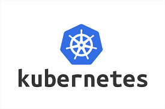

<h4 align="center"> 
    🚧 Kubernetes for the Absolute Beginners 🚀 Under construction... 🚧
  </h4>
   
  

    

  • <a href="#-about-the-project">About</a> •
    <a href="#-activities">Activities</a> •
    <a href="#-author">Author</a> •

---
## 💻 About the project

  Kubernetes is an open-source container orchestration system for automating software deployment, scaling, and management.
  Google originally designed Kubernetes, but the Cloud Native Computing Foundation now maintains the project.

---
## ⚙️ Activities
  
- [ ] Gain basic understanding of Kubernetes Fundamentals
- [ ] Develop Kubernetes Configuration Files in YAML
- [ ] Deploy Kubernetes Cluster on local systems
- [ ] Deploy Kubernetes on Cloud - Google Cloud Platform
- [ ] Deploy Applications on Kubernetes
- [ ] Setup ReplicaSets, Services and Deployments on Kubernetes

---
## 🦸 Author
---
<a href="#">
 
 

Made by Douglas Souza 👋🏽 Get in touch!

 

---
## README versions

[English 🇺🇸](./README.md)
